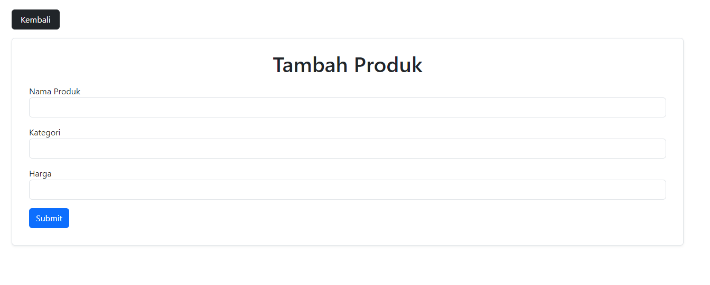

Install dependensi menggunakan Composer

```
composer install
```

Ganti "DB_DATABASE" di file .env sesuai dengan database Anda

Lakukan migrasi database untuk membuat tabel

```
    php artisan migrate
```

Lakukan seed database untuk mengisi data

```
    php artisan db:seed
```

## Product

### View


### Edit


### Create



## Reporting


